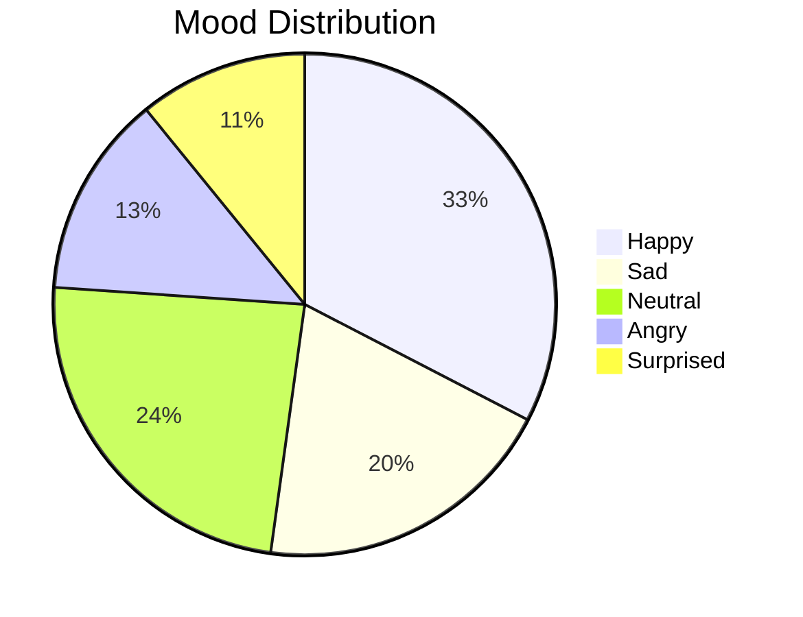
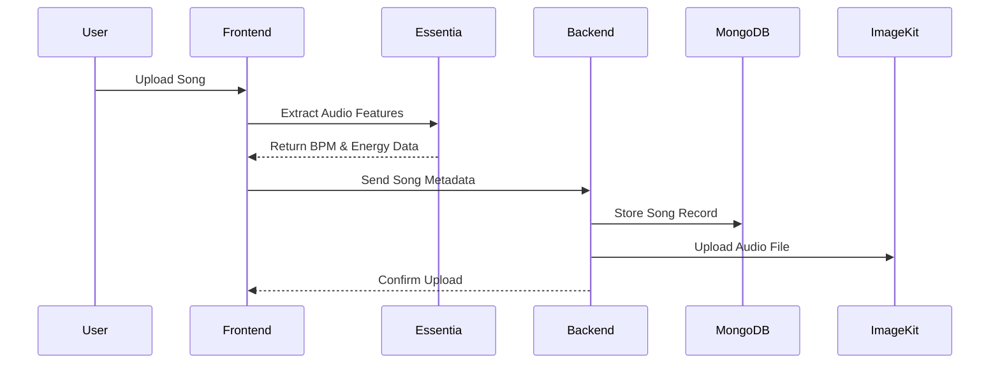
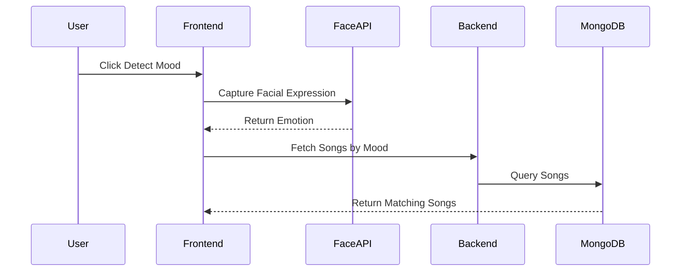
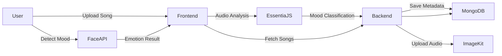

# 🎵 Moody Player  
## AI-Powered Music Ecosystem Based on Your Mood

<p align="center">
  
  
  
  
  
  
</p>

<p align="center">
  <strong>Detect Emotion → Analyze Music → Curate Playlists → Control Experience</strong>
</p>

---

# 🚀 Overview

Moody Player is a full-stack AI-powered music platform that intelligently connects:

- 🎭 Real-Time Facial Emotion Detection  
- 🎧 WASM-Based Audio Feature Intelligence  
- 📚 Advanced Playlist & Queue Management  
- 🔁 Smart Playback & Loop Controls  
- ☁️ Cloud File Storage  
- 💾 Persistent MongoDB Architecture  
- 📱 Fully Responsive Split-Screen UI  

This is not just a music player.  
It is a **mood-driven music engine designed with real-world architecture principles.**

---

# 📊 Mood Intelligence Dashboard

Moody Player classifies songs into five emotional categories using AI-powered audio and facial analysis.

## 🎵 Mood Distribution



---


# 🔄 Application Workflow

This section explains how Moody Player operates from user interaction to system response.

## 🎵 Song Upload Workflow



**Process Summary:**
1. User uploads audio file.
2. Essentia.js extracts audio features in-browser.
3. Mood classification assigned.
4. Metadata saved in MongoDB.
5. Audio file stored securely on ImageKit CDN.

---

## 🎭 Mood Detection Workflow



**Process Summary:**
1. Webcam activates.
2. face-api.js detects emotion.
3. System fetches songs matching mood.
4. Playlist auto-populates.

---

# 🧠 System Architecture



---

# 🎛 Core Features

## 🎭 Real-Time Mood Detection
- Webcam-based facial recognition
- Emotion confidence scoring
- Instant mood-based recommendation engine

---

## 🎧 Audio Intelligence (WASM)
- BPM detection
- Loudness measurement
- Spectral centroid mapping
- Energy scoring
- Automatic mood tagging

---

## 📚 Advanced Playlist Management
- Unlimited playlist creation
- Drag-and-drop queue reordering
- Cross-playlist copy system
- Duplicate prevention logic
- Real-time synchronization

---

## 🔁 Enhanced Playback Controls

| Mode | Function |
|------|----------|
| Normal | Sequential playback |
| Loop All | Repeat entire playlist |
| Loop One | Repeat single track |

Includes:
- Seekable progress bar
- Volume control
- Now playing section
- Auto next-track transition

---


# 📱 Responsive Design Optimization

- Mobile-first layout
- Adaptive split-screen
- Touch-friendly UI
- Zero layout shift structure

---

# ⚡ Tech Stack

## Frontend
- React 19 + Vite
- face-api.js
- Essentia.js (WASM)
- Axios
- Modern CSS3

## Backend
- Node.js
- Express.js
- MongoDB + Mongoose
- Multer
- ImageKit CDN

---

# 📦 Installation & Setup

## Backend

```bash
cd Backend
npm install

# Create .env file
# MONGODB_URI=
# IMAGEKIT_PUBLIC_KEY=
# IMAGEKIT_PRIVATE_KEY=
# IMAGEKIT_URL_ENDPOINT=

npx nodemon server.js
```

Backend runs on:
```
http://localhost:3000
```

---

## Frontend

```bash
cd Frontend
npm install
npm run dev
```

Frontend runs on:
```
http://localhost:5173
```

---

# 🔌 API Overview

| Method | Endpoint | Purpose |
|--------|----------|----------|
| POST | /playlists | Create playlist |
| POST | /playlists/:id/songs/upload | Upload song |
| POST | /playlists/:targetId/songs/transfer | Copy song |
| PUT | /playlists/:id/songs/reorder | Reorder queue |
| GET | /songs/mood/:mood | Fetch songs by mood |
| DELETE | /songs/:id | Delete song |

---

# 🏆 Why This Project Stands Out

Moody Player demonstrates:

- Real-time AI integration in web apps  
- WASM-powered audio intelligence  
- Complex drag-and-drop engineering  
- Full-stack CRUD architecture  
- Cloud-based file handling  
- Database relationship management  
- Responsive UI engineering  
- Production-level workflow design  

It merges **Machine Learning + UX + Full-Stack Engineering** into a cohesive ecosystem.

---

# ❤️ Final Note

Music feels different when it understands you.

Moody Player transforms emotion into sound —  
turning your face into your playlist.

⭐ If this project matches your vibe, consider starring the repository.
