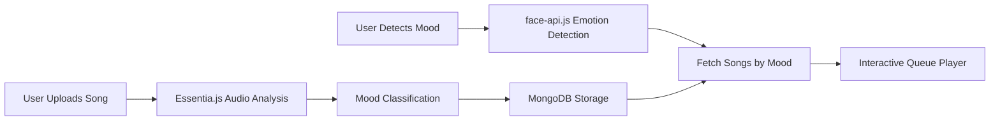
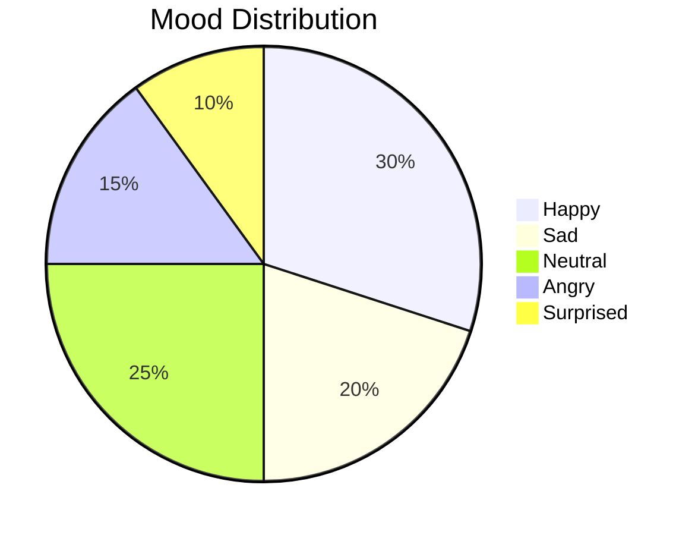
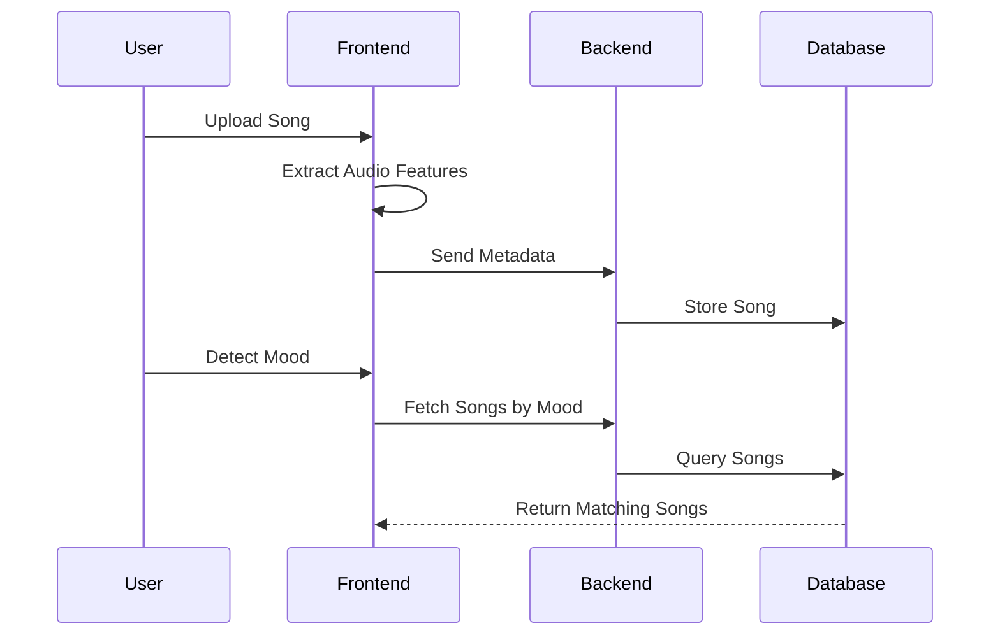

# 🎵 Moody Player  
### AI-Powered Music Engine Based on Your Mood

<p align="center">
  
  
  
  
  
  
</p>

<p align="center">
  <strong>Detect your emotion. Curate your vibe. Control your soundtrack.</strong>
</p>

---

# 🚀 Overview

Moody Player is a **full-stack AI-powered music platform** that merges:

- 🎭 Facial Emotion Recognition  
- 🎧 Audio Feature Intelligence (WASM-based)  
- 🎵 Interactive Drag-and-Drop Queue  
- ☁️ Cloud Storage Integration  
- 💾 Persistent MongoDB Backend  

This is not just a music player —  
it’s a **mood-driven music system.**

---

# 🧠 System Architecture



---

# 📊 Mood Intelligence Breakdown

Moody Player analyzes music using:

- 🎼 BPM (Tempo)
- 🔊 Loudness
- 🌈 Spectral Centroid
- ⚡ Zero Crossing Rate

### 🎵 Example Mood Distribution



---

# 🎛️ Core Features

## 🎭 Real-Time Mood Detection
- Webcam-based facial analysis
- Detects: Happy, Sad, Angry, Neutral, Surprised
- One-click mood detection
- Instant song recommendations

---

## 🎧 AI Audio Classification
- Essentia.js (WASM) feature extraction
- Automatic mood tagging
- Metadata persistence
- BPM & energy mapping logic

---

## 🎵 Interactive Queue System
- Drag & drop reordering
- Real-time search
- Playback controls (Play, Pause, Next, Previous)
- Persistent playback state
- Delete / Remove options

---

## ☁️ Cloud + Database Integration
- ImageKit CDN for file storage
- MongoDB for metadata storage
- Mood filtering endpoint
- Persistent across sessions

---

# ⚡ Tech Stack

## 🎨 Frontend
- React 19 + Vite
- face-api.js
- Essentia.js (WASM)
- Axios
- CSS3 (Modern UI)

## ⚙️ Backend
- Node.js
- Express.js
- MongoDB + Mongoose
- Multer
- ImageKit CDN

---

# 🔄 Application Workflow



---

# 📈 Feature Summary Table

| Capability | Implementation |
|------------|----------------|
| Emotion Detection | face-api.js |
| Audio Intelligence | Essentia.js WASM |
| Cloud Storage | ImageKit |
| Backend API | Express.js |
| Database | MongoDB |
| Dev Environment | Vite |
| File Upload Handling | Multer |

---

# 📦 Installation & Setup

## 🔹 Backend Setup

```bash
cd Backend
npm install

# Create .env file with:
# MONGODB_URI=
# IMAGEKIT_PUBLIC_KEY=
# IMAGEKIT_PRIVATE_KEY=
# IMAGEKIT_URL_ENDPOINT=

npx nodemon server.js
```

Backend runs on:

```
http://localhost:3000
```

---

## 🔹 Frontend Setup

```bash
cd Frontend
npm install
npm run dev
```

Frontend runs on:

```
http://localhost:5173
```

---

# 🔌 API Endpoints

| Method | Endpoint | Description |
|--------|----------|-------------|
| POST | /songs | Upload & classify song |
| GET | /songs?mood=happy | Fetch songs by mood |
| DELETE | /songs/:id | Delete song |

---

# 🎨 UI Experience

- Modern gradient header
- Clean two-column layout
- Smooth drag animations
- Mood badges
- Responsive design
- Minimalistic typography

---

# 🎯 Why This Project Stands Out

Moody Player demonstrates:

- AI integration in frontend apps
- WASM-based music processing
- Facial recognition
- Cloud file storage workflow
- Interactive UI engineering
- Full-stack CRUD architecture

It merges **Machine Learning + Music + UX + Full Stack Engineering** into one cohesive system.

---

# ❤️ Final Note

Music feels different when it understands you.

Moody Player transforms emotion into sound —  
turning your face into your playlist.

⭐ If this project matches your vibe, consider starring the repository.
