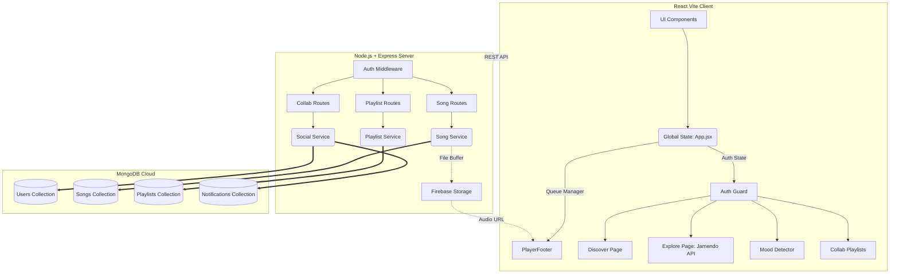
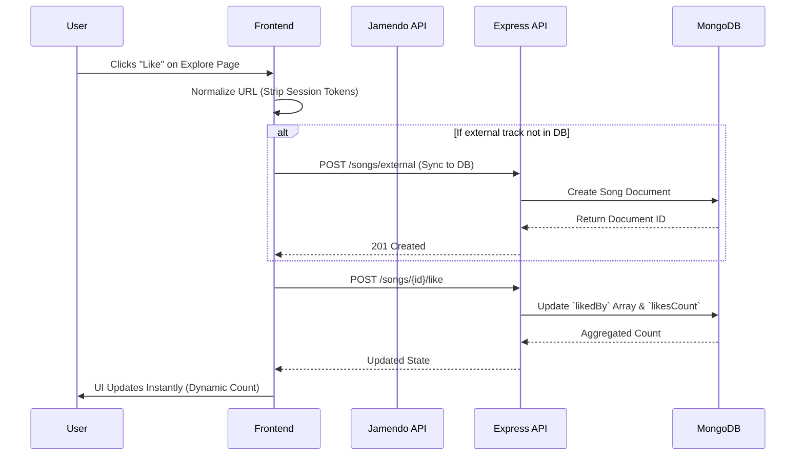
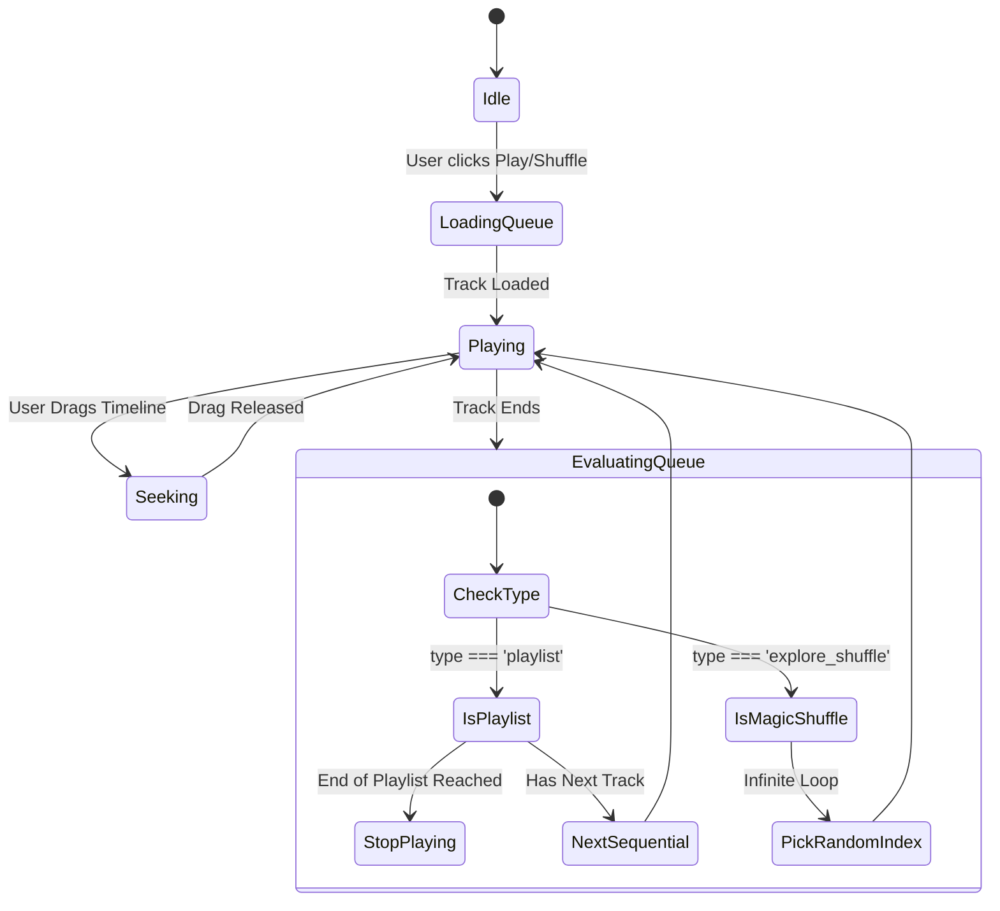

<div align="center">
  
  <h1>🎵 Moody Player</h1>
  <p><b>Next-Generation Mood-Based Audio Discovery & Collaborative Listening</b></p>

  [](#)
  [](#)
  [](#)
  [](#)
  [](#)
</div>

---

## 📖 Overview

**Moody Player** is a modern, full-stack music streaming and audio curation platform that blends intelligent mood-based listening with robust social collaboration. 

Designed with a premium dark-mode aesthetic and dynamic micro-animations, the application offers an infinite "Magic Shuffle", independent user-specific mood queues, real-time collaboration on playlists, and an integrated social graph.

---

## 🏗 Architecture Execution Map

The system uses a decoupled client-server architecture with state-driven dynamic routing, centralized audio streaming, and an intelligent global queue manager.


```mermaid
graph TD
    %% Frontend Layer
    subgraph Frontend [React Vite Client]
        A[UI Components] --> B(Global State: App.jsx)
        B --> |Queue Manager| C[PlayerFooter]
        B --> |Auth State| D[Auth Guard]
        
        %% Pages
        D --> E[Discover Page]
        D --> F[Explore Page: Jamendo API]
        D --> G[Mood Detector]
        D --> H[Collab Playlists]
    end

    %% Backend Layer
    subgraph Backend [Node.js + Express Server]
        I[Auth Middleware] --> J[Song Routes]
        I --> K[Playlist Routes]
        I --> L[Collab Routes]
        
        %% Services
        J --> M(Song Service)
        K --> N(Playlist Service)
        L --> O(Social Service)
        
        M -.-> |File Buffer| P[Firebase Storage]
    end

    %% Database Layer
    subgraph Database [MongoDB Cloud]
        Q[(Users Collection)]
        R[(Songs Collection)]
        S[(Playlists Collection)]
        T[(Notifications Collection)]
    end

    %% Connections
    Frontend <==REST API==> Backend
    M ==> R
    N ==> S
    O ==> Q
    O ==> T
    P -.-> |Audio URL| C
```

---

## ✨ Core Features & Analytics

### 🧠 Intelligent Mood Queue
- **Personalized Isolation:** Every user has a strictly isolated `moodLibrary` anchored to their profile.
- **Duplicate Handling:** Uploading a track that already exists in the global DB automatically aliases the track to the user's permanent queue, preventing storage bloat while persisting across sessions.
- **Auto-Detection:** Analyzes audio files on upload to dynamically assign moods (Happy, Sad, Chill, Energetic).

### 🌍 Explore & Magic Shuffle
- **Jamendo API Integration:** Dynamically fetches royalty-free music.
- **Infinite Magic Shuffle:** An algorithm that auto-feeds the global queue with random tracks, creating an endless listening loop.
- **Global Likes Sync:** Features a highly optimized state unification system. Likes are mapped using a normalized URL hashing system, perfectly aligning database entries with real-time UI interactions across the app.

### 🤝 Real-Time Collaboration & Social Graph
- **Role-Based Access Control:** Playlists support `owners` and `contributors`.
- **Social Graph:** Fully functional "Following" and "Follower" ecosystem.
- **Real-Time Notifications:** In-app notification center that dynamically updates when users send collaboration invites or follow requests.

---

## 📊 Data Flow Analytics


```mermaid
sequenceDiagram
    participant User
    participant Frontend
    participant Jamendo API
    participant Express API
    participant MongoDB

    User->>Frontend: Clicks "Like" on Explore Page
    Frontend->>Frontend: Normalize URL (Strip Session Tokens)
    
    alt If external track not in DB
        Frontend->>Express API: POST /songs/external (Sync to DB)
        Express API->>MongoDB: Create Song Document
        MongoDB-->>Express API: Return Document ID
        Express API-->>Frontend: 201 Created
    end
    
    Frontend->>Express API: POST /songs/{id}/like
    Express API->>MongoDB: Update `likedBy` Array & `likesCount`
    MongoDB-->>Express API: Aggregated Count
    Express API-->>Frontend: Updated State
    Frontend->>User: UI Updates Instantly (Dynamic Count)
```

---

## ⚙️ Component Lifecycle (The Player Engine)

The core audio engine resides in `PlayerFooter.jsx`, orchestrated by state passed down from `App.jsx`.


```mermaid
stateDiagram-v2
    [*] --> Idle
    Idle --> LoadingQueue: User clicks Play/Shuffle
    LoadingQueue --> Playing: Track Loaded
    
    Playing --> Seeking: User Drags Timeline
    Seeking --> Playing: Drag Released
    
    Playing --> EvaluatingQueue: Track Ends
    
    state EvaluatingQueue {
        [*] --> CheckType
        CheckType --> IsPlaylist: type === 'playlist'
        CheckType --> IsMagicShuffle: type === 'explore_shuffle'
        
        IsPlaylist --> StopPlaying: End of Playlist Reached
        IsPlaylist --> NextSequential: Has Next Track
        
        IsMagicShuffle --> PickRandomIndex: Infinite Loop
    }
    
    NextSequential --> Playing
    PickRandomIndex --> Playing
```

---

## 💻 Tech Stack Breakdown

### Frontend Environment
- **Core:** React 18, Vite
- **Styling:** Vanilla CSS (CSS Variables, Flexbox/Grid, Glassmorphism, Responsive Media Queries)
- **State Management:** React Hooks (`useState`, `useEffect`) lifted to root.
- **Audio API:** Native HTML5 `Audio` element dynamically controlled via React Refs.
- **Icons:** Remix Icons

### Backend & Infrastructure
- **Server:** Node.js, Express.js
- **Database:** MongoDB (Mongoose ODM)
- **Authentication:** JWT (JSON Web Tokens), bcrypt
- **Storage:** Firebase/GCP Storage for audio blobs, Jamendo storage for external CDNs.
- **Middleware:** Multer (Memory Storage for Buffer Hash generation), Custom Auth Guards.

---

## 🚀 Local Setup Instructions

### Prerequisites
- Node.js (v18+)
- MongoDB connection string
- Jamendo API Client ID

### 1. Clone the Repository
```bash
git clone https://github.com/your-username/moody-player.git
cd moody-player
```

### 2. Configure Backend
```bash
cd Backend
# Install dependencies from package.json (versions specified in req.txt)
npm install
```
Create a `.env` file in the `Backend` directory with the following variables:
```env
PORT=3000
MONGODB_URI=your_mongodb_connection_string
JWT_SECRET=your_super_secret_jwt_key
GOOGLE_CLIENT_ID=your_google_client_id
GOOGLE_CLIENT_SECRET=your_google_client_secret
FIREBASE_PROJECT_ID=your_firebase_project_id
FIREBASE_PRIVATE_KEY="your_firebase_private_key"
FIREBASE_CLIENT_EMAIL=your_firebase_client_email
```
Start the backend server:
```bash
npm run dev
```

### 3. Configure Frontend
```bash
cd ../Frontend
# Install dependencies from package.json (versions specified in req.txt)
npm install
```
Create a `.env` file in the `Frontend` directory with the following variables:
```env
VITE_JAMENDO_CLIENT_ID=your_jamendo_api_client_id
VITE_GOOGLE_CLIENT_ID=your_google_client_id
```
Start the frontend development server:
```bash
npm run dev
```

---

<div align="center">
  <p>Built with ❤️ by Raj</p>
</div>
