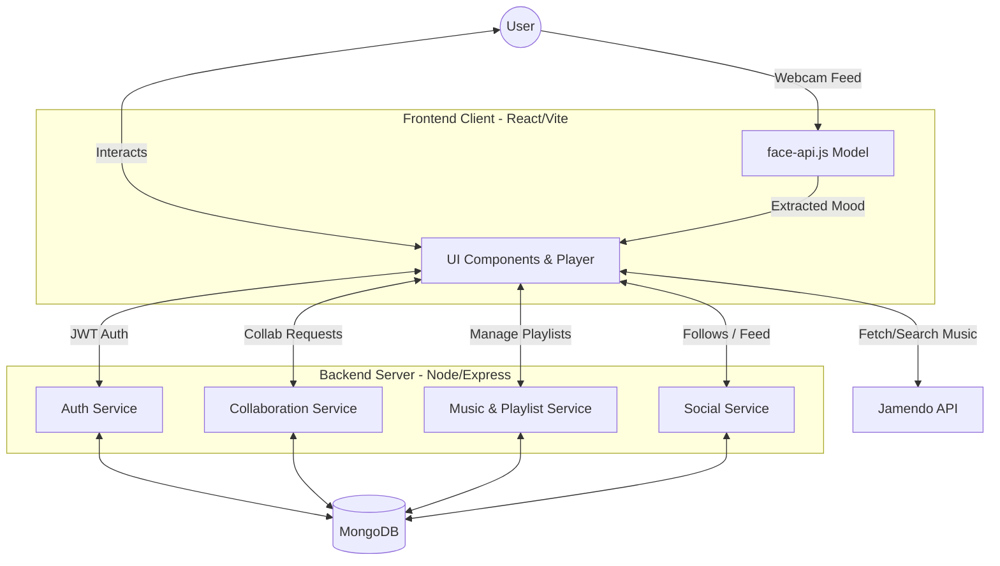
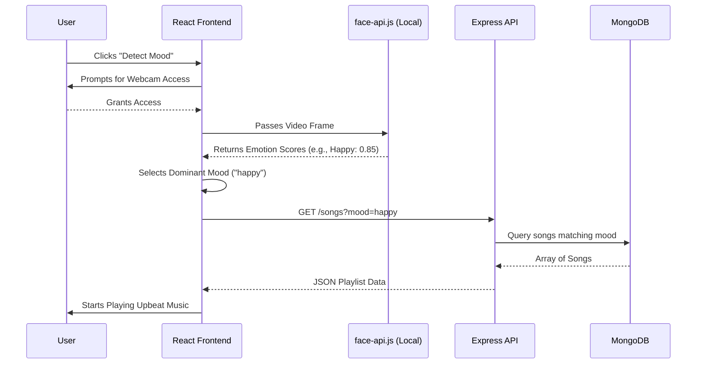
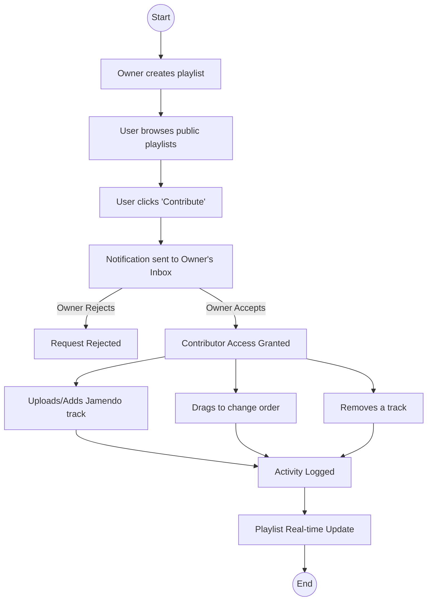
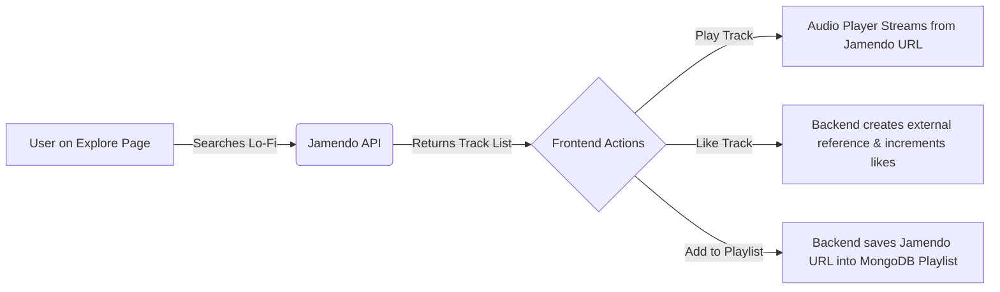

<div align="center">
  
  # 🎵 Moody Player
  
  **AI-Powered Facial Recognition Music Curation & Collaborative Platform**

  [](#)
  [](#)
  [](#)
  [](#)
  [](#)
  [](#)
  
  <br />

  > Moody Player is a modern, AI-powered music application that curates personalized, mood-based playlists by detecting your facial expressions in real-time. Designed with collaboration and social interaction in mind, Moody Player allows you to discover new music, share your playlists, collaborate with friends, and see what the community is listening to.

  **[✨ View Live Demo ✨](https://moody-player-1pva.onrender.com)**
  
  <br />
  
   
  <br />
  *(Feel free to replace this with your own gorgeous high-res screenshot!)*

</div>

<br />

---

## 🌊 Platform Architecture & Data Flow

Moody Player is composed of several interconnected subsystems that blend AI, social networking, and real-time collaboration. Below is a detailed view of how data flows through the platform.

### 1. High-Level System Architecture

This diagram illustrates the macro-level interactions between the User, the Frontend (React + AI Models), the Backend API, and external services like Jamendo.


```mermaid
flowchart TD
    %% Entities
    User((User))
    Jamendo[Jamendo API]
    
    %% Frontend Layer
    subgraph Frontend [Frontend Client - React/Vite]
        UI[UI Components & Player]
        FaceAPI[face-api.js Model]
    end

    %% Backend Layer
    subgraph Backend [Backend Server - Node/Express]
        Auth[Auth Service]
        CollabServ[Collaboration Service]
        MusicServ[Music & Playlist Service]
        SocialServ[Social Service]
    end

    %% Database Layer
    DB[(MongoDB)]

    %% Connections
    User <-->|Interacts| UI
    User -->|Webcam Feed| FaceAPI
    FaceAPI -->|Extracted Mood| UI
    
    UI <-->|JWT Auth| Auth
    UI <-->|Fetch/Search Music| Jamendo
    UI <-->|Manage Playlists| MusicServ
    UI <-->|Collab Requests| CollabServ
    UI <-->|Follows / Feed| SocialServ
    
    Auth <--> DB
    CollabServ <--> DB
    MusicServ <--> DB
    SocialServ <--> DB
```

---

### 2. The Core AI Music Flow

When a user visits the main page, the application uses their webcam to detect their current emotion and instantly curates a listening experience.


```mermaid
sequenceDiagram
    participant User
    participant Browser as React Frontend
    participant AI as face-api.js (Local)
    participant API as Express API
    participant DB as MongoDB

    User->>Browser: Clicks "Detect Mood"
    Browser->>User: Prompts for Webcam Access
    User-->>Browser: Grants Access
    Browser->>AI: Passes Video Frame
    AI-->>Browser: Returns Emotion Scores (e.g., Happy: 0.85)
    Browser->>Browser: Selects Dominant Mood ("happy")
    Browser->>API: GET /songs?mood=happy
    API->>DB: Query songs matching mood
    DB-->>API: Array of Songs
    API-->>Browser: JSON Playlist Data
    Browser->>User: Starts Playing Upbeat Music
```

---

### 3. Collaborative Playlist Lifecycle

Moody Player allows users to request edit access to public playlists. Once approved, contributors can add, delete, or reorder songs, with every action tracked in an activity ledger.

*(Note: Kept flat to ensure compatibility with all Markdown renderers!)*


```mermaid
flowchart TD
    Start((Start)) --> Owner[Owner creates playlist]
    Owner --> Discovery[User browses public playlists]
    Discovery --> Request[User clicks 'Contribute']
    
    Request --> Inbox[Notification sent to Owner's Inbox]
    Inbox -->|Owner Rejects| Rejected[Request Rejected]
    Inbox -->|Owner Accepts| Accepted[Contributor Access Granted]
    
    Accepted --> Action1[Uploads/Adds Jamendo track]
    Accepted --> Action2[Drags to change order]
    Accepted --> Action3[Removes a track]
    
    Action1 --> Log[Activity Logged]
    Action2 --> Log
    Action3 --> Log
    
    Log --> Update[Playlist Real-time Update]
    Update --> End((End))
```

---

### 4. External Discovery (Jamendo Integration)

Users can step out of their local library to discover trending, royalty-free tracks worldwide and bring them into the Moody ecosystem.


```mermaid
flowchart LR
    A[User on Explore Page] -->|Searches Lo-Fi| B(Jamendo API)
    B -->|Returns Track List| C{Frontend Actions}
    
    C -->|Play Track| D[Audio Player Streams from Jamendo URL]
    C -->|Like Track| E[Backend creates external reference & increments likes]
    C -->|Add to Playlist| F[Backend saves Jamendo URL into MongoDB Playlist]
```

---

## ✨ Key Features

- **🎭 AI Facial Expression Detection**: Utilizes your device's webcam and `face-api.js` to analyze your current facial expression and automatically curate a customized music queue matching your mood.
- **🤝 Real-time Collaborative Playlists**: Create playlists and invite friends to contribute. Manage incoming contribution requests via a dedicated inbox, and see real-time playlist activity and analytics.
- **🌍 Social & Discovery Hub**: Follow other users, see their public playlists, and get notified about their latest activity. 
- **🎧 Jamendo API Integration**: Explore trending, royalty-free tracks directly from independent artists using the Jamendo API. Play them instantly or save them to your personal playlists.
- **🎨 Premium UI/UX**: Features a highly responsive, mobile-first design with a beautiful custom theme system (Charcoal and Deep Blue), glassmorphism effects, and smooth micro-animations.

---

## 🛠 Tech Stack Overview

| **Domain** | **Technology** | **Description** |
|:---:|:---|:---|
| **Frontend** | React (Vite) | Blazing-fast development and optimized production builds. |
| **Routing** | React Router | Seamless, client-side navigation. |
| **AI/ML** | Face-api.js | Runs in-browser, lightweight AI models to detect moods. |
| **Styling** | Vanilla CSS | Fully custom, responsive styling without heavy CSS frameworks. |
| **Backend** | Node.js & Express.js | Robust, scalable backend architecture. |
| **Database** | MongoDB & Mongoose | Flexible NoSQL database for managing data relations. |
| **Auth** | JWT | Secure user login and registration flow. |

---

## 🚀 Getting Started

Follow these instructions to get a copy of the project up and running on your local machine for development and testing purposes.

### Prerequisites
- **Node.js** (v16+)
- **MongoDB** (Local instance or MongoDB Atlas cluster)
- A free **Jamendo Developer Client ID** (for the Explore feature)

### 1. Backend Setup
```bash
# Navigate to the Backend directory
cd Backend

# Install dependencies
npm install
```

Create a `.env` file in the `Backend` directory and configure the following variables:
```env
PORT=3000
MONGO_URI=your_mongodb_connection_string
JWT_SECRET=your_super_secret_jwt_key
```

```bash
# Start the backend development server
npm run dev
```

### 2. Frontend Setup
```bash
# Open a new terminal and navigate to the Frontend directory
cd Frontend

# Install dependencies
npm install
```

Create a `.env` file in the `Frontend` directory and add your Jamendo Client ID:
```env
VITE_JAMENDO_CLIENT_ID=your_jamendo_client_id
```

```bash
# Start the frontend development server
npm run dev
```

Navigate to `http://localhost:5173` in your browser to view the app!

---

## 📁 Project Structure

```text
Moody Player/
├── Backend/                 # Express Server & API routes
│   ├── src/
│   │   ├── controllers/     # Route logic
│   │   ├── middleware/      # Auth & file upload middlewares
│   │   ├── models/          # Mongoose schemas (User, Playlist, Song, etc.)
│   │   ├── routes/          # Express route definitions
│   │   ├── service/         # Business logic & integrations
│   │   └── index.js         # Server entry point
│   └── package.json
│
├── Frontend/                # React UI
│   ├── public/              # Static assets & AI Models (/models)
│   ├── src/
│   │   ├── components/      # React components (Sidebar, PlayerFooter, Pages)
│   │   ├── utils/           # Helper functions (audio mood extraction)
│   │   ├── App.jsx          # Main application routing
│   │   └── index.css        # Global design tokens and utilities
│   └── package.json
└── README.md
```

<div align="center">
  <br/>
  <i>This project is for educational and portfolio purposes. Data fetched from Jamendo is subject to Jamendo's API usage terms.</i>
</div>
