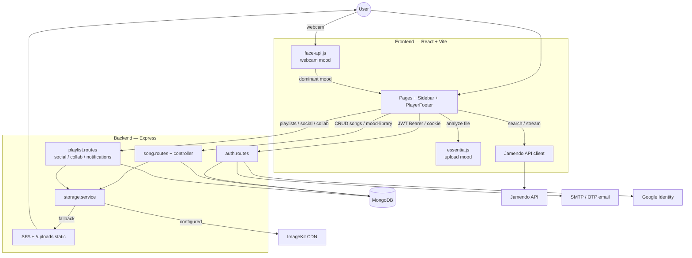
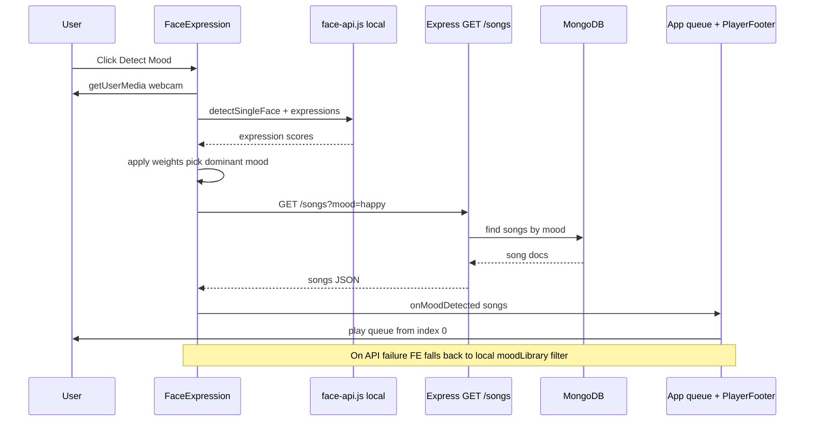
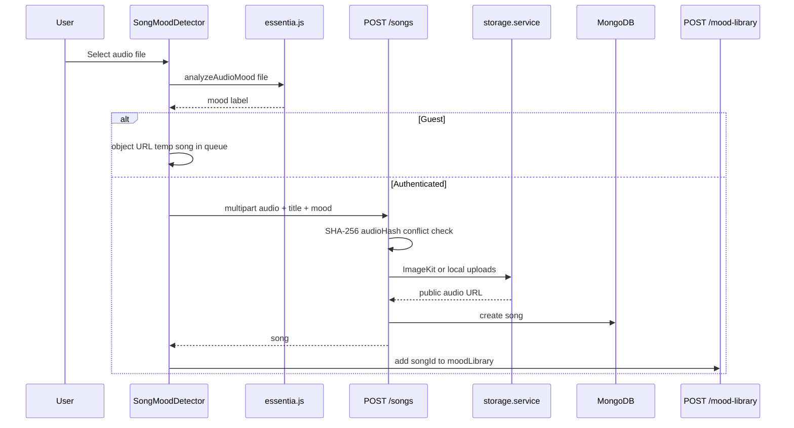
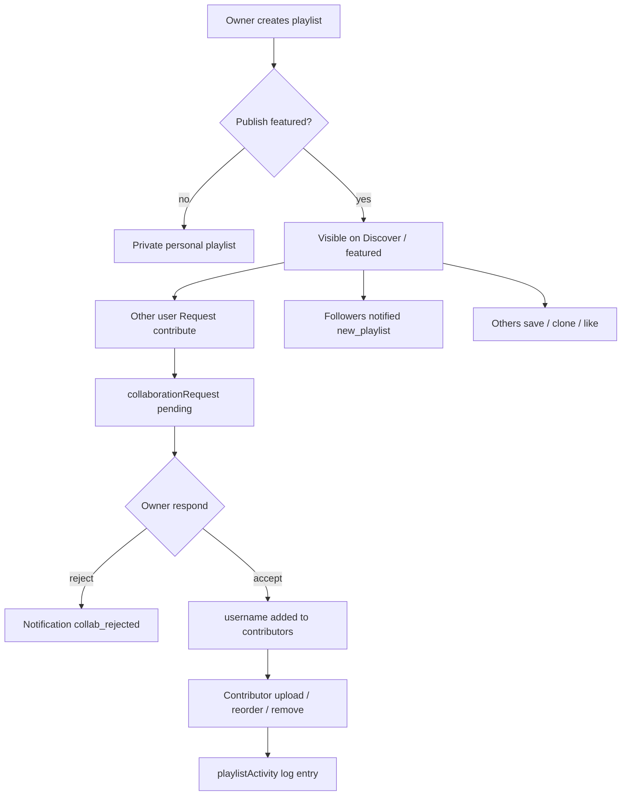
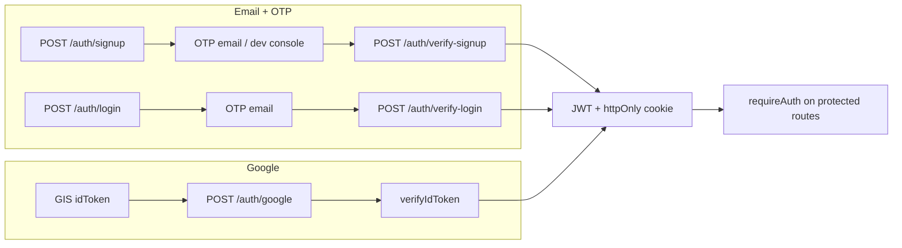
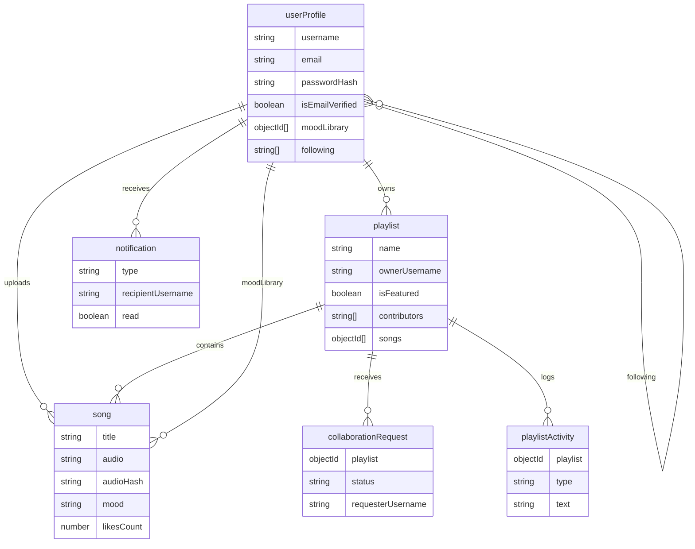
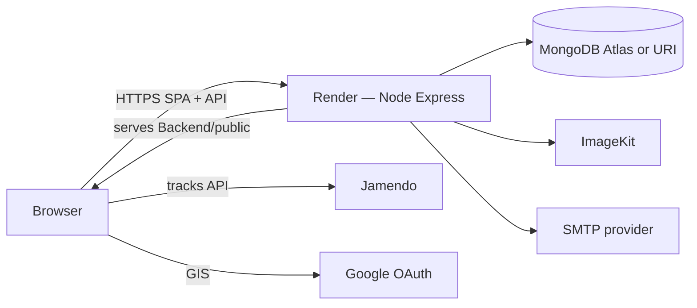

# Moody Player

## 1. Snapshot
- **One-liner:** In-browser facial mood detection that queues matching tracks, plus collaborative featured playlists and social discovery.
- **Who it is for:** Listeners who want mood-based queues without manual browsing, and users who want to publish, save, and co-edit public playlists.
- **What success looks like:** Detect a mood from webcam → play matching songs; upload/analyze audio into a persistent mood library; discover Jamendo tracks; follow users and collaborate on featured playlists with an activity log.

## 2. Problem

### Pain
Music apps usually make you pick playlists or genres by hand. That breaks down when mood changes quickly and you do not want to search, build a queue, or maintain tags yourself.

Uploading personal tracks creates another gap: files land in a library with no mood metadata unless the user labels them. Without that label, “play something that fits how I feel” cannot work reliably.

Sharing music with friends is usually either fully private or fully public with no contribution workflow. People who want a public playlist others can help curate need request/approve access, not just a share link.

### Who suffered
- **Casual listeners** who want a queue matched to how they look/feel in the moment, without building playlists first
- **Uploaders** who add local audio but lack automatic mood tagging
- **Playlist curators** who want public, co-editable lists with ownership controls and a history of changes

### Constraints
- Client-side AI only (`face-api.js` + `essentia.js`); no server-side ML inference
- Single Express process serves both API and built SPA (Render deployment)
- External catalog via Jamendo client ID on the frontend; audio/image CDN via ImageKit with local disk fallback
- Auth must support email OTP and Google sign-in across local Vite (`localhost:5173`) and same-origin production
- Educational / portfolio scope; no WebSockets — collaboration and notifications are REST + persisted documents

### Problem statement (1 sentence)
Build a music web app that maps a detected facial mood to a playable queue, stores mood-tagged uploads centrally, and supports social discovery with request-based playlist collaboration.

## 3. Solution

### Approach
Moody Player is a React (Vite) SPA backed by Node/Express and MongoDB. Mood detection runs entirely in the browser: `face-api.js` reads a webcam frame, applies weighted expression scores, then requests `GET /songs?mood=…`. Uploads run client-side audio analysis (`essentia.js`: BPM, RMS, spectral centroid, ZCR) before `POST /songs`, so mood tags are attached before persistence.

The backend owns identity (JWT + httpOnly cookie, bcrypt passwords, email OTP, Google ID-token verify), a central song catalog with SHA-256 `audioHash` dedupe, playlists (private vs featured), collaboration requests, activity logs, follows, and notifications. Media uploads go through ImageKit when configured, otherwise local `uploads/` served by Express.

Explore calls Jamendo’s public API from the browser, then optionally registers tracks via `POST /songs/external` (URL-normalized so the same track maps to one DB row). Production builds point API calls at the Render host; Express also serves `Backend/public` and SPA fallbacks for client routes.

### Core features shipped
- **Facial mood → song queue:** Webcam + TinyFaceDetector/FaceExpressionNet; weighted dominant mood; fetch mood-filtered songs; start global player queue
- **Audio mood tagging on upload:** Essentia WASM features → mood label; optional manual override; guest local blob queue vs authenticated persist + mood library
- **Per-user mood library:** Ordered song IDs on `userProfile.moodLibrary`; add / remove / reorder endpoints; reload-safe queue for logged-in users
- **Central song catalog + likes:** Upload or external Jamendo URL; hash/title+artist conflict handling; like toggle and top-liked listing
- **Playlists (private / featured):** Create, cover upload, publish toggle, clone featured into personal library, save/rename featured saves, like playlist
- **Collaboration workflow:** Request contribute on featured playlists; owner inbox accept/reject; contributors add/remove/reorder; activity ledger
- **Social layer:** Search users, follow/unfollow, follower stats, profile discovery, in-app notifications (follow, new playlist, like, collab reject, messages)
- **Auth:** Signup/login OTP (SMTP or controlled dev fallback), Google OAuth, profile photo via ImageKit/local, COOP headers for GIS popups
- **Global audio player:** Shared queue in `App.jsx` across mood, playlist, and explore-shuffle sources; themes charcoal / deepblue

## 4. Architecture

### High-level system

### Facial mood → playback flow

### Upload + audio mood tagging flow

### Collaboration lifecycle

### Auth paths

### Data model (simplified)

### Deployment topology

## 5. Challenges & decisions

### Emotion classifier bias toward neutral
Face-api raw scores often over-rank `neutral`. The client multiplies expression scores with hand-tuned weights (e.g. boost angry/sad, dampen neutral) before picking the dominant mood. Tradeoff: better variety of moods in practice, but weights are heuristic, not trained on this app’s users.

### Central song identity without duplicate bloat
Songs are shared across playlists and mood libraries. Deduping uses SHA-256 of file bytes (`audioHash`) plus normalized title+artist fallback. Concurrent uploads handle Mongo duplicate-key `11000` by re-reading the existing doc. Startup drops a legacy unique index on `titleKey` so same titles with different artists/hashes remain valid. External Jamendo URLs strip session query params (`from`) before hashing so one track → one record.

### Storage portability on a student/portfolio host
`storage.service` prefers ImageKit; on missing config or upload failure it writes under `uploads/` and returns a `BACKEND_PUBLIC_URL`-based URL. Keeps local/dev working without CDN credentials; production quality depends on ImageKit being set.

### Same-origin SPA + API on Render
Express serves the Vite build from `Backend/public`, sets COOP/`unsafe-none` CEOP for Google popups, and uses a catch-all `/{*splat}` for client routes. Frontend `api.js` switches base URL on `import.meta.env.PROD`. CORS is fixed to Vite dev origin for local work.

### Collaboration is not true realtime
There is no Socket.io/WebSocket layer. “Collaborative” means REST mutate + `playlistActivity` documents + notification docs. Activity is fetch-on-visit, not live push. Chosen to keep the stack simple for deployment and scope.

### OTP delivery vs local development
Signup/login require email OTP when SMTP is configured. `ALLOW_DEV_OTP_FALLBACK=true` logs OTP to the server console when SMTP is incomplete — useful for demos, dangerous if enabled in real production.

### Guest vs authenticated product split
Guests can detect mood and play (and hold temporary object-URL uploads). Persist, playlists, notifications, likes, and mood library require JWT. Keeps the homepage usable without an account while protecting write surfaces.

## 6. Outcomes

- **Shipped** full-stack app live at `https://moody-player-1pva.onrender.com`
- **End-to-end mood loop:** webcam detect → weighted mood → Mongo mood query → shared player queue
- **Upload intelligence:** client Essentia analysis tags mood before server store
- **Social product surface:** featured hub, profiles, follows, notifications, collab request inbox
- **Operational hardening visible in history:** Google COOP fixes, discover/explore bugfixes, SPA/static serving fixes, auth error handling
- **Test suite:** N/A (no automated tests in `package.json`; manual verification via UI)

## 7. Tech stack

| Layer | Choice | Role in this repo |
|:---|:---|:---|
| Frontend | React 19, Vite 7, React Router 6 | SPA pages, global player state in `App.jsx` |
| Styling | Custom CSS + CSS variables | Themes `charcoal` / `deepblue` |
| Client AI | face-api.js | Webcam expression → mood |
| Client audio ML | essentia.js (WASM) | Upload feature → mood |
| HTTP client | axios + fetch | API and Jamendo |
| Backend | Node.js, Express 5 | REST API + static SPA |
| DB | MongoDB + Mongoose 9 | Users, songs, playlists, collab, activity, notifications |
| Auth | JWT, bcryptjs, Google Auth Library, nodemailer | Cookie + Bearer; OTP; Google |
| Uploads | multer (memory), ImageKit SDK, local disk | Audio, covers, profile photos |
| External music | Jamendo v3 API | Explore / trending / search |
| Hosting | Render (per live URL + prod API base) | Single Node service |

## 8. Module map

| Area | Key paths |
|:---|:---|
| Server entry | `Backend/server.js`, `Backend/src/app.js` |
| Auth | `Backend/src/routes/auth.routes.js`, `Backend/src/middleware/auth.middleware.js` |
| Songs | `Backend/src/routes/song.routes.js`, `controllers/song.controller.js`, `service/song.service.js`, `utils/song.util.js` |
| Playlists / social | `Backend/src/routes/playlist.routes.js` |
| Storage | `Backend/src/service/storage.service.js` |
| Models | `Backend/src/models/*.model.js` |
| App shell / routing | `Frontend/src/App.jsx`, `Frontend/src/config/api.js` |
| Mood UI | `FaceExpression.jsx`, `SongMoodDetector.jsx`, `MoodPage.jsx`, `utils/audioMood.js` |
| Explore | `ExploreSongsPage.jsx` |
| Social UI | `FeaturedHubPage.jsx`, `DiscoverProfilePage.jsx`, `NotificationsPage.jsx` |

### Frontend routes
| Path | Access |
|:---|:---|
| `/` | Public mood home |
| `/explore` | Public Jamendo explore |
| `/discover`, `/discover/users/:username` | Public discovery |
| `/playlists`, `/playlists/:id`, `/playlists/:id/activity` | Auth required |
| `/notifications` | Auth required |
| `/login`, `/signup` | Auth pages |

## 9. Limitations (honest)
- Collaboration/activity is request-response, not live multiplayer editing
- Mood labels from face/audio models are approximate; weights and Essentia rules are heuristics
- Global playlist name uniqueness (`checkDuplicateName`) is a product constraint, not per-user namespacing
- CORS allowlist is hard-coded to `http://localhost:5173` for browser API use during local Vite; production relies on same-origin SPA
- No automated test suite in repo
- Env secrets (Mongo, JWT, SMTP, ImageKit, Google, Jamendo) required for full feature set — values omitted here by design

## 10. Role summary
Solo full-stack build: React client (mood AI, player, social UI), Express/Mongo API (auth, songs, playlists, collab, notifications), ImageKit/local media, Jamendo integration, and Render deployment of the combined SPA+API.
